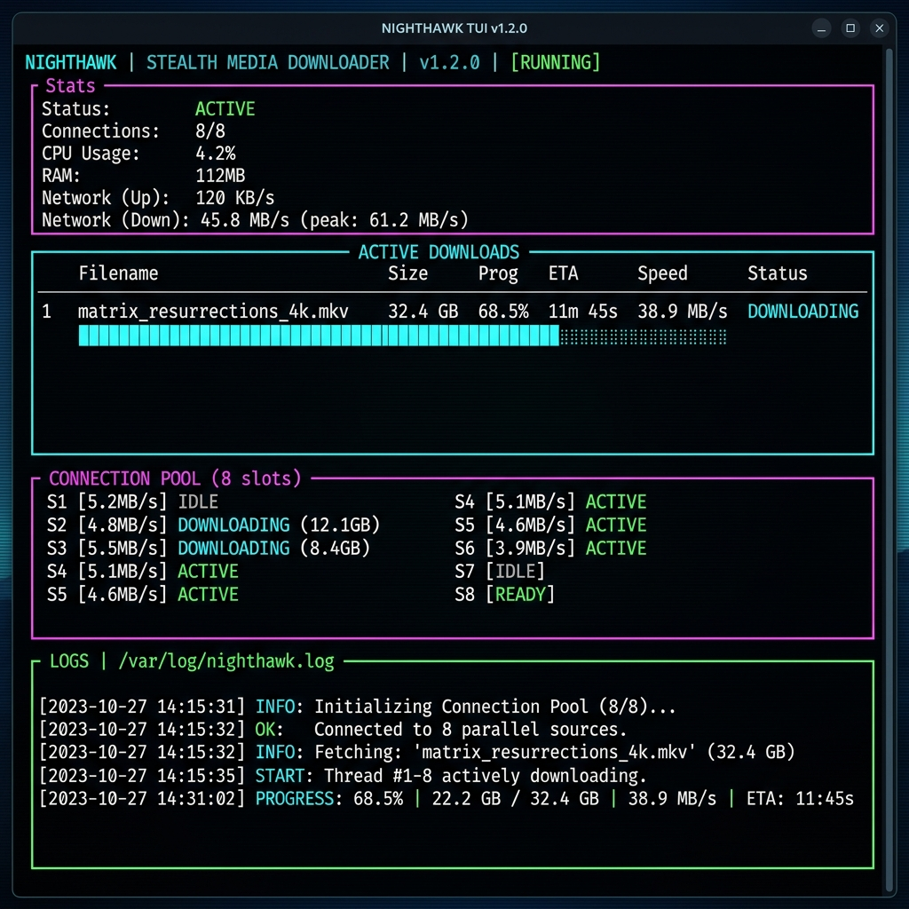

# ▲ Stealth Telegram Downloader (stealth-dl)

```text
   ▄▄▄▄▄▄▄ ▄▄▄▄▄▄▄ ▄▄▄▄▄▄▄ ▄▄▄▄▄▄  ▄▄▄     ▄▄▄▄▄▄▄ ▄▄   ▄▄    ▄▄▄▄▄▄  ▄▄
  █       █       █       █      ██   █   █       █  █ █  █  █      ██  █
  █  ▄▄▄▄▄█▄     ▄█    ▄──█  ▄    █   █   █    ▄──█  █▄█  █  █  ▄    █  █
  █ █▄▄▄▄▄  █   █ █   █▄▄ █ █ █   █   █   █   █▄▄ █       █  █ █ █   █  █
  █▄▄▄▄▄  █ █   █ █    ──██ █▄█   █   █▄▄ █    ──██       █  █ █▄█   █  █▄▄▄▄▄
   ▄▄▄▄▄█ █ █   █ █   █▄▄ █       █       █   █▄▄ █   ▄   █  █       █       █
  █▄▄▄▄▄▄▄█ █▄▄▄█ █▄▄▄▄▄▄▄█▄▄▄▄▄▄█ █▄▄▄▄▄▄█▄▄▄▄▄▄▄█▄▄█ █▄▄█  █▄▄▄▄▄▄█▄▄▄▄▄▄▄▄█
```

[](https://www.python.org/)
[](LICENSE)
[](#-architecture)
[](https://github.com/astral-sh/ruff)

A private, high-speed, and resilient Telegram media downloader daemon designed to run on self-hosted home servers. It automatically downloads movies, series, or files forwarded or dropped into its chat and saves them directly to your storage directory, with boot-time queue recovery and ghost deletion of processed messages.

### 🖥️ Live TUI Console Dashboard Preview


---

## ⚡ Key Features

* **Parallel Chunk Downloader**: Saturation of high-bandwidth networks via multi-connection parallel chunk downloading using a custom MTProto connection pool.
* **Smart Resume**: Saved byte-offset state tracking (`.state` files) allows interrupted downloads to resume seamlessly without losing progress.
* **Persistent Recovery Queue**: Auto-saves pending items in a local JSON log (`pending_queue.json`) to survive crashes, power cuts, or daemon reboots.
* **Gorgeous TUI Console Dashboard**: Real-time download speeds, connection pool health, queue size, and daemon activity logs rendered directly in alternate terminal screens.
* **Ticking Ignition Fuse**: A 5-second cancelable fuse on Telegram prevents accidental file queueing.
* **Ghost Message Deletion**: Wipes the original file drops and status messages on Telegram upon completion to maintain absolute privacy.

---

## 🚀 Quickstart

### 1. Installation

Run the automated, fully-animated installer script for your operating system:

**Windows**:
```cmd
install.bat
```

**Linux/macOS**:
```bash
chmod +x install.sh
./install.sh
```

The installer verifies your Python environment, installs dependency packages, and launches the interactive configuration wizard.

### 2. Configure Manually

If you prefer to configure manually, write the credential values into a `.env` file in the root folder:

```ini
TG_API_ID=123456
TG_API_HASH="your_telegram_api_hash"
TG_BOT_TOKEN="your_bot_token"
TG_ALLOWED_USER_ID=987654321
TG_DOWNLOAD_DIR="/DATA/Media/Movies/"
```

### 3. Run the Daemon

Start the public client version:
```bash
python stealth_dl.py
```

Or run the compiled standalone local client:
```bash
python stealth_dl_local.py
```

---

## 🛠 Telegram Interactivity

Once the daemon is online, you can interact with the bot using the following commands:

* `/start` — Displays configuration parameters and commands.
* `/queue` — Shows current active download status, speed, and pending items.
* `/pause` — Pauses the active download connection stream.
* `/resume` — Unfreezes connection senders and resumes transfer.
* `/cancel` — Cancels the current download and purges the partial file.
* `/clear` — Wipes all chat history in the conversation thread.

---

## 🏗 Modular Architecture

To align with modern clean-code principles, `stealth-dl` is structured modularly:

* `stealth_dl.py`: Thin bootstrapping entry point.
* `stealth_dl/config.py`: Environment variables parser and validation.
* `stealth_dl/state.py`: Global state managers and logging handlers.
* `stealth_dl/utils.py`: Text formatters and progress bar generator.
* `stealth_dl/database.py`: Queue loaders, savers, and chunk state savers.
* `stealth_dl/engine.py`: High-speed parallel connection senders.
* `stealth_dl/tui.py`: Interactive Console TUI renderer.
* `stealth_dl/bot.py`: Telegram event handlers and command router.

---

## 🧪 Testing

Run unit tests via `pytest` to verify helpers and database serialization logic:
```bash
pytest
```

---

## 🔒 License

Distributed under the MIT License. See [LICENSE](LICENSE) for details.

---
Developed with ❤️ by [cid-moosa](https://github.com/cid-moosa)
